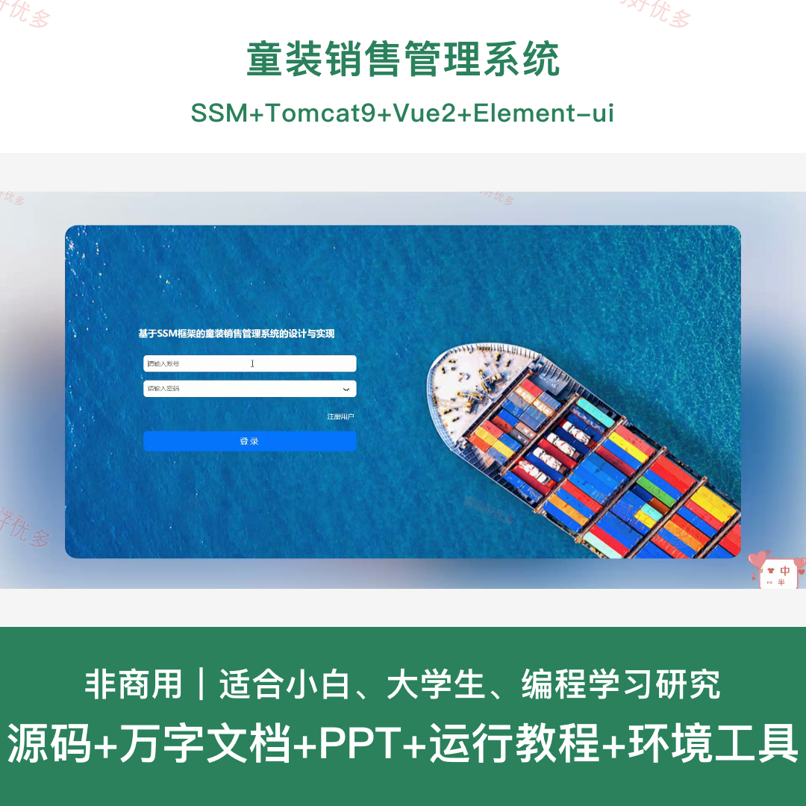
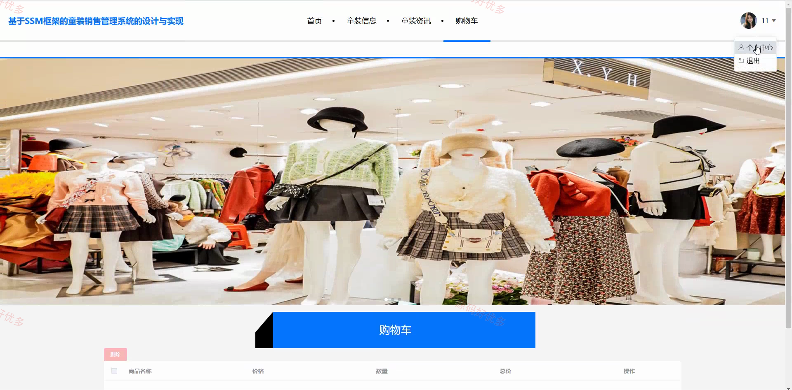
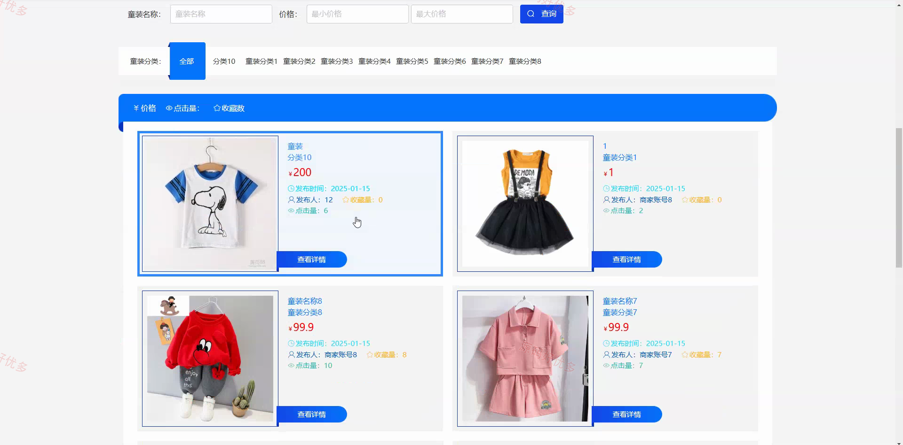
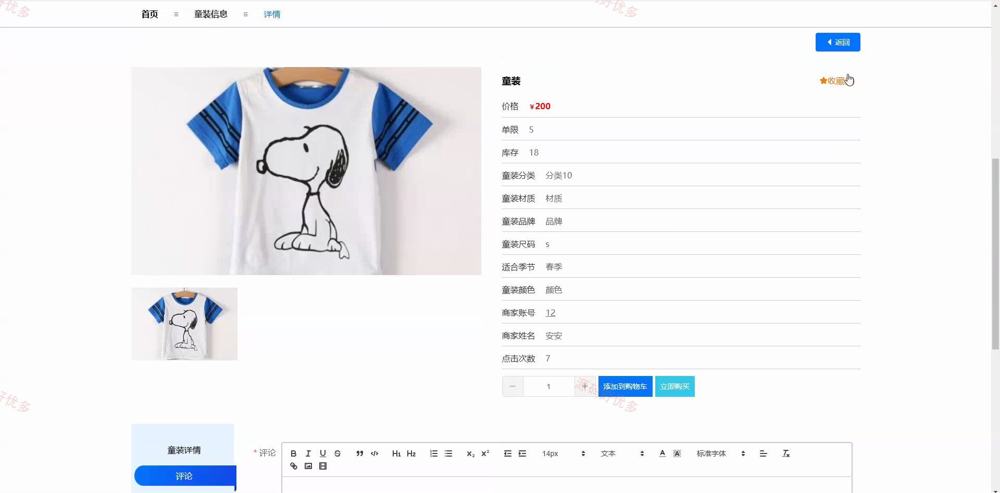
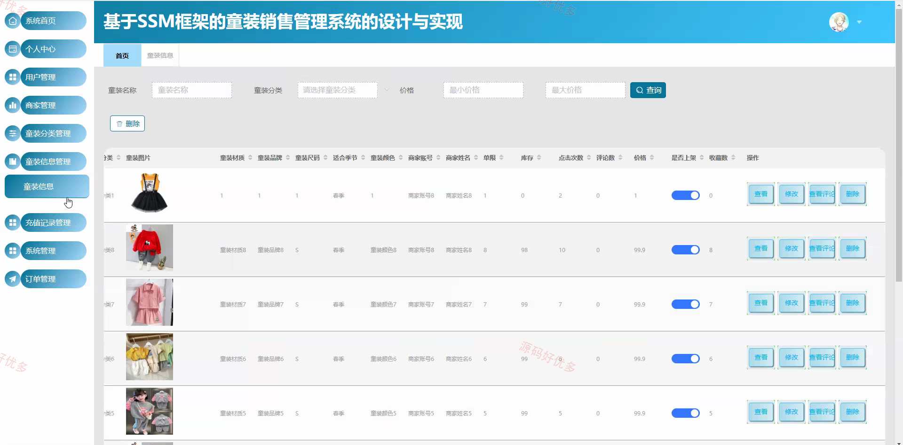
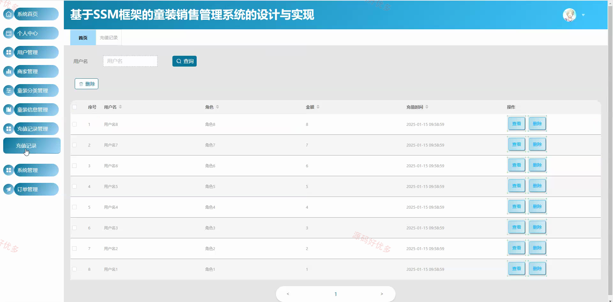
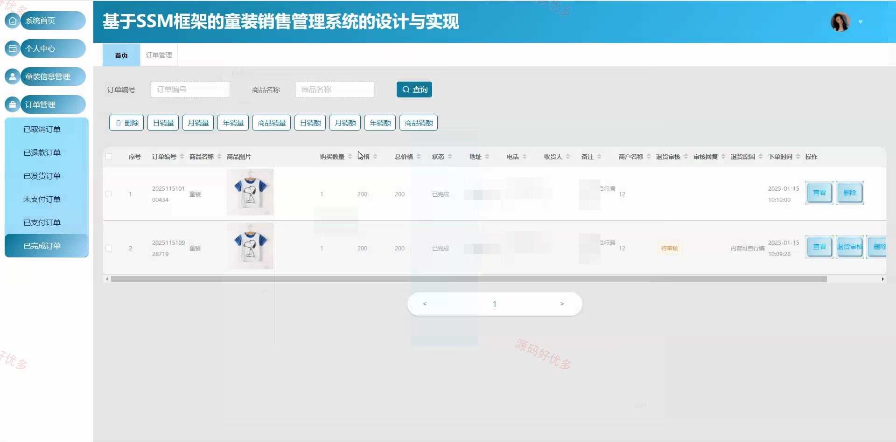
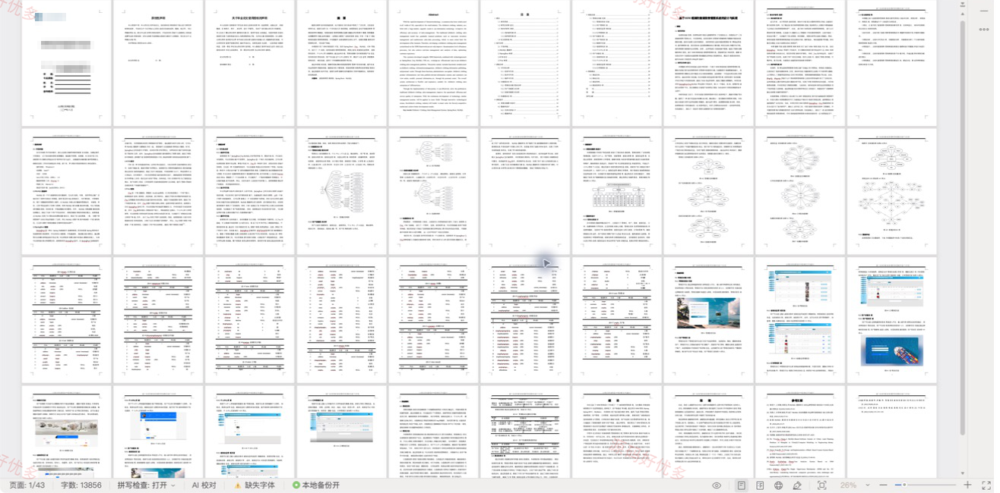

## 源码问题查看主页咨询

### 一、关键词
童装销售管理系统、童装销售、童装销售订单管理、童装销售在线交易

### 二、作品包含
源码+数据库+万字设计文档+PPT+全套环境和工具资源+本地部署教程

### 三、项目技术
前端技术： Html、Css、Js、Vue2.6、Element-ui
后端技术：Java、SSM（Spring 5.0.0、Spring MVC、MyBatis-Plus 2.3）

### 四、运行环境（以下版本亲测，其他版本兼容性请自行测试）
开发工具：IDEA/eclipse + VSCODE

数据库：MySQL5.7+（共21张表）

数据库管理工具：Navicat10以上版本

环境配置软件： JDK1.7 + Maven3.6.3 + Tomcat9.0.29

前端Nodejs：14+

浏览器：谷歌浏览器

### 五、项目介绍
项目编号：ssm007D

童装销售管理系统面向管理员、商家和用户，提供童装展示、分类维护、购物车与在线购买、订单处理、资讯发布和评价互动等业务功能。

角色：管理员、商家、用户

管理员功能：用户与商家管理、童装分类管理、童装信息管理、订单管理、童装资讯管理、充值记录管理、系统内容维护。

商家功能：童装信息维护、订单管理、童装信息查看。

用户功能：童装浏览与筛选、童装收藏、购物车管理、在线购买与支付、订单管理、童装评论、个人中心。

### 六、运行截图

